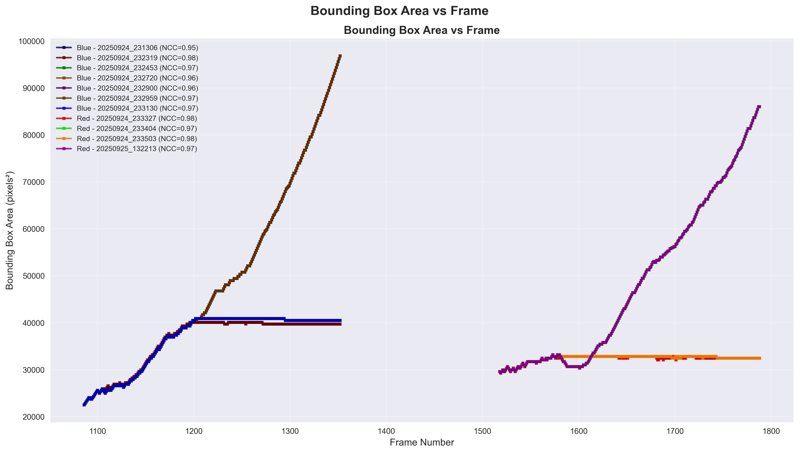
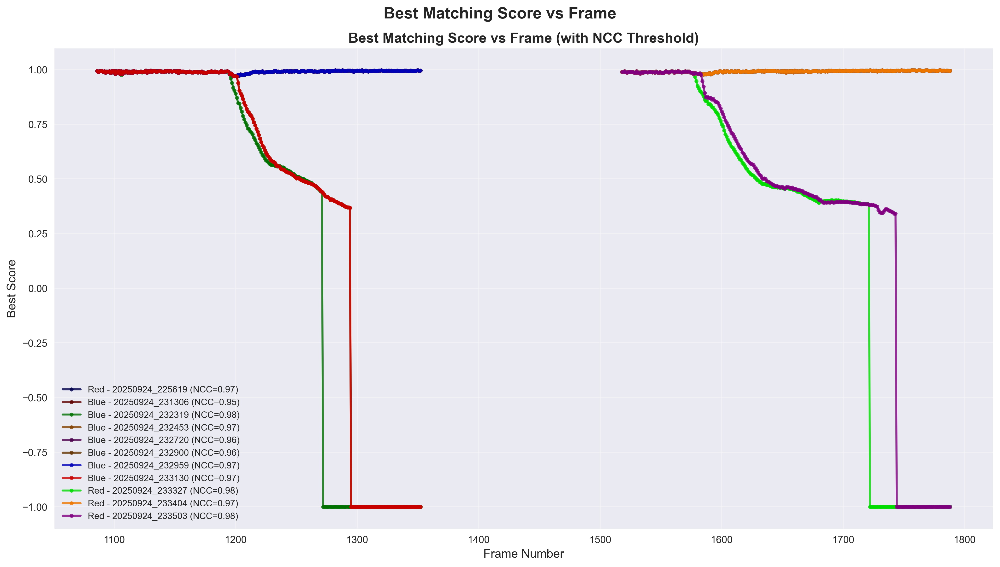

# YOPO -- You Only Pick Once

> This is the source code for the first project of DIP (Digital Image Processing) course in UESTC, UofG.

## Environment Setup

On M2-chip MacOS or Ubuntu 22.04, create and activate the conda environment:

```bash
conda env create -f environment.yml
conda activate yopo
```

### Delete Environment

Do this to undo any change you made for building this project:

```bash
conda activate base
conda env remove -n yopo
```

## Run

```bash
python main.py
python plot.py
```

There is also another file without any plot information, which is better to read:

```bash
python minimal_main.py
```

## Results






## Code Structure

### Classes

- `CurrentImage()`: All read 
    - `CurrentKernel()`

- `KernelBuffer()`

## Some Notes

### 变量规范:

- 类名: 开头大写驼峰
- 类中 utility 性质的方法 (函数): 下划线开头
- 标量、向量、一般函数: 开头小写下划线分割
- 常量: 全大写下划线
- 类实例变量: 每个单词开头大写下划线