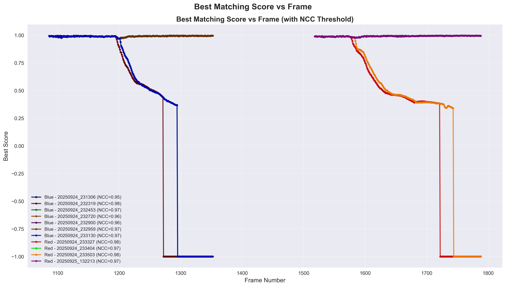

# YOPO -- You Only Pick Once

> A brief introduction to this project is [here](https://marcobisky.github.io/posts/yopo/).

> This is the source code for the first project of DIP (Digital Image Processing) course in UESTC, UofG.

## Environment Setup

### Windows

Use docker to run this project on Windows:

- Install Docker Desktop and VcXsrv:
    - **Docker Desktop** - Install from https://www.docker.com/products/docker-desktop/
    - **VcXsrv** (X Server for Windows) - Download from https://sourceforge.net/projects/vcxsrv/

- Double click `XLaunch` with the following options:
    - Multiple windows
    - Display number: 0
    - Start no client
    - **IMPORTANT: Check "Disable access control"**
    - Save configuration for future use

- Simply double-click `run_windows.bat`, the script will:
    - Build the Docker container (first time only)
    - Run the tracking program
    - Display live visualization windows
    - Generate GIF files in the `gifs/` folder

### MacOS / Ubuntu

On M2-chip MacOS or Ubuntu 22.04, the process is much simpler:

```bash
git clone https://github.com/Marcobisky/YOPO.git
conda env create -f environment.yml
conda activate yopo
python main.py # If you want to run the complete program
python plot.py # If you want to generate plots
python minimal_main.py # If you don't want to see any plots
```

#### Delete Environment

Do this to undo any change you made for building this project:

```bash
conda activate base
conda env remove -n yopo
```

## Results





## Code Structure

### Main Files

- `main.py`: Complete tracking program with logging, trajectory visualization, and search space heatmap
- `minimal_main.py`: Simplified version with basic tracking functionality only
- `plot.py`: Generate analysis plots from logged data

### Classes

- `CurrentImage()`: Represents an image frame
    - Attributes: `image_content_GRB` (BGR image data)
    - Methods: `to_gray()`, `get_size()`
    
- `CurrentKernel(CurrentImage)`: Represents a tracking kernel/template
    - Attributes: `bbox` (x, y, width, height), `scale` (scale factor)
    - Inherits all methods from `CurrentImage`

- `KernelBuffer()`: Manages kernel history and prediction
    - Attributes: `buffer` (kernel history), `best_kernel`, `vx_avg`, `vy_avg` (velocity)
    - Methods:
        - `add_kernel()`: Add new kernel and update velocity
        - `update_best_kernel()`: Update the best matching kernel
        - `get_cloud()`: Generate search space around predicted position
        - `_predict_cloud_center()`: Predict next kernel position

- `Config()`: Configuration parameters
    - `length_for_prediction`: Number of frames for velocity prediction
    - `pad_pixels`: Search space padding in pixels
    - `step_size_pixels`: Search step size in pixels
    - `pad_scale`: Scale search range
    - `step_size_scale`: Scale search step size
    - `ncc_threshold`: NCC matching threshold
    - `color_threshold`: Color similarity threshold
    - `weight`: Moving average weight for velocity

- `TrackingLogger()`: Log tracking results (main.py only)
    - Methods: `log_frame()`, `save_log()`

- `SearchSpaceVisualizer()`: Visualize 2D search space (main.py only)
    - Methods: `update_search_space()`

- `GifGenerator()`: Generate GIF animations (main.py only)
    - Methods: `add_frame()`, `save_gif()`

### Core Functions

- `_extract_patch(Image, bbox)`: Extract image patch at bounding box
- `_ncc_score(Current_Image, Current_Kernel)`: Compute NCC matching score
- `_compute_color_hist(Image)`: Compute HSV color histogram
- `_is_color_similar(Image, Kernel_Image, Config)`: Check color similarity
- `initialize_tracker(image_folder, init_bbox, Config)`: Initialize tracking system
- `update_next_kernel(Current_Image, Kernel_Buffer, Config)`: Find best matching kernel
- `visualization(Current_Image, Best_Kernel, score)`: Display tracking results

## Some Notes

### 变量规范:

- 类名: 开头大写驼峰
- 类中 utility 性质的方法 (函数): 下划线开头
- 标量、向量、一般函数: 开头小写下划线分割
- 常量: 全大写下划线
- 类实例变量: 每个单词开头大写下划线